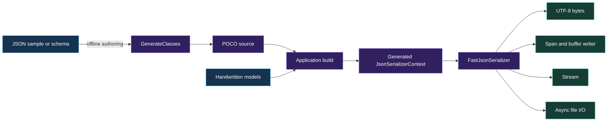
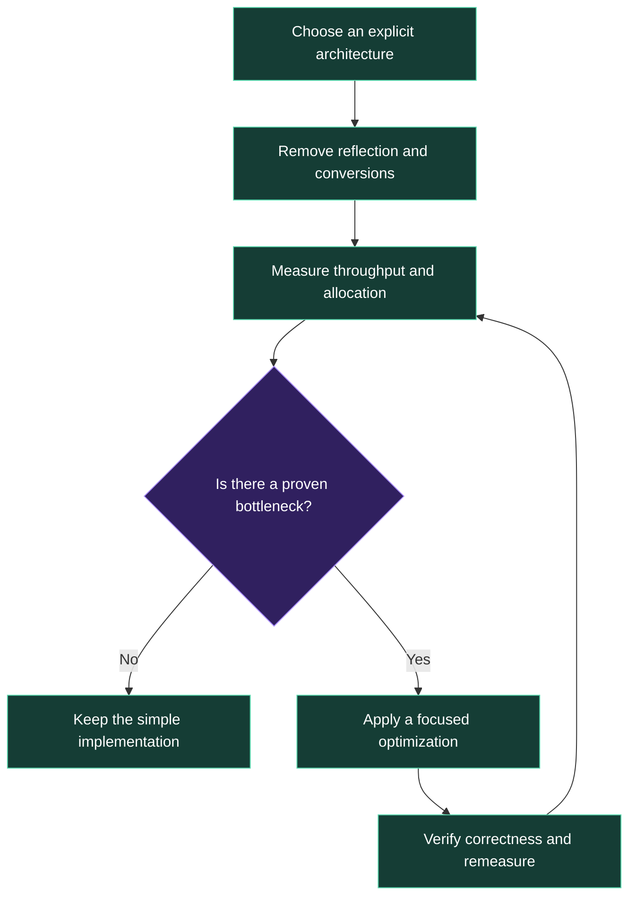

<div align="center">

[](https://dotnet.microsoft.com/)


**UTF-8 first · allocation-conscious · source-generated · stream-ready · benchmark-led**

</div>

---

`FastJson.Net10` is a production-oriented .NET 10 library for high-throughput JSON serialization, deserialization, import, and export. Its performance-sensitive APIs require source-generated `JsonTypeInfo<T>`, making the optimized path explicit and preventing accidental reflection fallback.

This project is more than a serializer. It demonstrates a repeatable strategy for building efficient software:

> **Move repeatable work to compile time, make expensive behavior difficult to select accidentally, preserve data in its native representation, and add complexity only when measurements justify it.**

## Why this is a foundation for fast codebases

Fast applications rarely come from one clever algorithm. They come from architectural decisions that prevent unnecessary work from entering the system.

| Foundation principle | How FastJson applies it | How it transfers elsewhere |
|---|---|---|
| **Make the fast path explicit** | Hot-path methods require `JsonTypeInfo<T>` | Require prepared queries, compiled templates, or validated plans at API boundaries |
| **Move work to build time** | Source generation replaces runtime metadata discovery | Generate mappings, parsers, clients, and lookup tables during compilation |
| **Use the native representation** | UTF-8 bytes, spans, streams, and buffers are first-class | Avoid unnecessary text, object, and format conversions between layers |
| **Expose ownership clearly** | Callers may provide streams, buffers, or writers | Let high-throughput callers control storage and lifetimes |
| **Keep convenience off the critical path** | String APIs exist, but UTF-8 APIs are primary | Separate ergonomic boundary APIs from internal hot loops |
| **Earn complexity with evidence** | No unsafe code or speculative pooling | Add caching, pooling, SIMD, or custom allocators only after profiling |

These principles apply equally well to database access, networking, logging, file processing, message queues, and service-to-service contracts.

## The key architectural decision

The tempting API is:

```csharp
Serialize<T>(T value)
```

It looks convenient, but it cannot guarantee that `T` has generated metadata. The implementation must allow reflection, perform a resolver lookup, depend on global registration, or fail later at runtime.

FastJson requires the optimized contract at the call site:

```csharp
var utf8Json = FastJsonSerializer.SerializeUtf8(
    product,
    AppJsonContext.Default.Product);
```

That small choice creates strong system-wide guarantees:

- no accidental reflection fallback in the hot path;
- predictable startup and steady-state behavior;
- lower metadata and allocation overhead;
- trimming and Native AOT compatibility;
- compile-time visibility of supported models;
- straightforward profiling and code review.

## Architecture



There are two intentionally separate stages:

1. **Model generation** produces C# source from JSON or JSON Schema.
2. **Serializer source generation** runs during compilation and produces optimized metadata and serialization code.

Runtime-generated classes cannot be inserted into an already-compiled `JsonSerializerContext`. `GenerateClasses` therefore emits source for the next build instead of pretending dynamic runtime types can receive compile-time fast paths.

## Measured performance


FastJson intentionally stays near direct source-generated `System.Text.Json` performance because it is a thin, strongly constrained layer over that engine. Its value is not a mysterious serializer replacement—it packages the correct fast-path choices into an API that is difficult to misuse.

For the measured payload, the FastJson UTF-8 path delivered approximately **1.74× the throughput** and used **76% fewer allocated bytes** than reflection-based string serialization.

> Benchmarks are workload-specific. Run the included harness with representative models, payload sizes, hardware, runtime settings, and concurrency before making production decisions.

## Features

- Source-generated serialization fast path
- Source-generated metadata for deserialization
- UTF-8 `ReadOnlySpan<byte>` input
- Direct `byte[]` output
- Caller-owned `IBufferWriter<byte>` output
- Caller-owned `Utf8JsonWriter` support
- Synchronous stream import and export
- Asynchronous stream and file I/O
- Cancellation-token propagation
- JSON sample-to-POCO generation
- Practical JSON Schema-to-POCO generation
- Nullable and required-member inference
- Native AOT and trimming compatibility
- No third-party runtime dependencies
- No unsafe code
- No speculative object or array pooling

## Quick start

### 1. Reference the library

Use the project directly:

```xml
<ItemGroup>
  <ProjectReference Include="path/to/FastJson.Net10.csproj" />
</ItemGroup>
```

Or reference the packaged DLL/NuGet artifact produced in `artifacts/`.

### 2. Define a model

```csharp
public sealed class Product
{
    public required Guid Id { get; init; }
    public required string Name { get; init; }
    public decimal Price { get; init; }
    public DateTimeOffset UpdatedAt { get; init; }
}
```

### 3. Define the source-generated context

```csharp
using System.Text.Json;
using System.Text.Json.Serialization;

[JsonSourceGenerationOptions(
    JsonSerializerDefaults.Web,
    GenerationMode = JsonSourceGenerationMode.Default,
    WriteIndented = false,
    PropertyNameCaseInsensitive = false,
    RespectNullableAnnotations = true,
    RespectRequiredConstructorParameters = true)]
[JsonSerializable(typeof(Product))]
[JsonSerializable(typeof(List<Product>))]
internal partial class AppJsonContext : JsonSerializerContext;
```

`JsonSourceGenerationMode.Default` generates both metadata for deserialization and optimized serialization code for the fast path.

### 4. Serialize and deserialize

```csharp
var bytes = FastJsonSerializer.SerializeUtf8(
    product,
    AppJsonContext.Default.Product);

var copy = FastJsonSerializer.Deserialize(
    bytes.AsSpan(),
    AppJsonContext.Default.Product);
```

No intermediate JSON string is required.

## High-throughput buffers

Write directly into caller-owned storage:

```csharp
using System.Buffers;

var buffer = new ArrayBufferWriter<byte>();

FastJsonSerializer.Serialize(
    buffer,
    product,
    AppJsonContext.Default.Product);

ReadOnlySpan<byte> json = buffer.WrittenSpan;
```

For extremely hot loops, own and reuse an appropriately configured `Utf8JsonWriter`, then use the writer overload. Measure first: writer reuse introduces lifecycle and state-management responsibilities that many applications do not need.

## Streams and files

```csharp
await FastJsonSerializer.ExportAsync(
    destinationStream,
    product,
    AppJsonContext.Default.Product,
    cancellationToken);

var imported = await FastJsonSerializer.ImportAsync(
    sourceStream,
    AppJsonContext.Default.Product,
    cancellationToken);
```

File operations use asynchronous, sequentially optimized `FileStream` instances:

```csharp
await FastJsonSerializer.ExportFileAsync(
    "product.json",
    product,
    AppJsonContext.Default.Product,
    cancellationToken);

var product = await FastJsonSerializer.ImportFileAsync(
    "product.json",
    AppJsonContext.Default.Product,
    cancellationToken);
```

## API overview

| Operation | API | Allocation profile |
|---|---|---|
| JSON string | `Serialize(value, typeInfo)` | Allocates a UTF-16 string |
| UTF-8 bytes | `SerializeUtf8(value, typeInfo)` | Allocates the returned byte array |
| Existing buffer | `Serialize(bufferWriter, value, typeInfo)` | Uses caller-owned storage |
| Existing writer | `Serialize(utf8JsonWriter, value, typeInfo)` | Caller controls writer and flush behavior |
| String input | `Deserialize(json, typeInfo)` | Consumes an existing UTF-16 string |
| UTF-8 input | `Deserialize(utf8Span, typeInfo)` | Avoids an intermediate string |
| Stream I/O | `Import`, `Export`, `ImportAsync`, `ExportAsync` | Streams without materializing a full string |
| File I/O | `ImportFileAsync`, `ExportFileAsync` | Async sequential file access |

## Generate C# models

### From representative JSON

```csharp
var source = JsonClassGenerator.GenerateClasses(
    json,
    options: new JsonClassGeneratorOptions
    {
        Namespace = "MyCompany.Catalog",
        RootClassName = "Product",
        ContextName = "CatalogJsonContext"
    });

await File.WriteAllTextAsync("Product.generated.cs", source);
```

The generated file contains:

- nested POCO classes;
- `[JsonPropertyName]` mappings;
- nullable properties inferred from missing or null values;
- numeric-width promotion across samples;
- date, timestamp, and GUID inference;
- an optional source-generated serializer context.

### From JSON Schema

```csharp
var source = JsonClassGenerator.GenerateClasses(
    schema,
    JsonClassInputKind.JsonSchema,
    new JsonClassGeneratorOptions
    {
        Namespace = "MyCompany.Orders",
        RootClassName = "Order",
        ContextName = "OrderJsonContext"
    });
```

Supported schema features include objects, required members, arrays, typed dictionaries, nullable type arrays, `oneOf`/`anyOf` merging, local JSON Pointer `$ref`, numeric formats, and `date`, `date-time`, and `uuid` string formats.

Unsupported or incompatible unions safely fall back to `JsonElement`. Remote references are rejected explicitly. The generator is a model-authoring tool, not a complete JSON Schema validator.

## The optimization strategy



### Remove hidden work

Reflection, implicit resolver chains, repeated encoding conversions, and global mutable configuration are difficult to see at a call site. FastJson moves those choices into explicit parameters and compile-time declarations.

### Preserve data shape

JSON is UTF-8. Keeping it as UTF-8 avoids converting bytes into UTF-16 strings and back into bytes for files, sockets, HTTP bodies, queues, and storage.

### Separate tooling from the hot path

Class inference is useful but not latency-critical. Serialization is latency-critical. Keeping those concerns separate enables rich generation tooling without placing dynamic code generation in production request paths.

### Compose with platform primitives

The library builds on `JsonTypeInfo<T>`, `ReadOnlySpan<byte>`, `IBufferWriter<byte>`, `Utf8JsonWriter`, `Stream`, and `CancellationToken`. These are interoperable platform contracts, not custom abstractions that trap an application inside the library.

### Optimize in the correct order

1. Choose the correct architecture.
2. Remove unnecessary conversions and reflection.
3. Measure throughput and allocation.
4. Find the actual bottleneck.
5. Add complexity only when the data supports it.

Pooling and unsafe code can improve a proven bottleneck, but they also introduce retained memory, lifecycle rules, data-leak risks, and maintenance cost. FastJson deliberately avoids them until a specific workload proves they are worthwhile.

## When to use it

FastJson is a strong fit for:

- APIs processing large request volumes;
- workers consuming JSON messages;
- import/export pipelines;
- allocation-sensitive services;
- Native AOT or trimmed applications;
- applications that want serialization contracts visible at compile time.

Use plain `JsonSerializer` directly when serialization is infrequent, startup and allocation are irrelevant, or source-generation setup would add more complexity than value.

## Project layout

```text
FastJson.Net10/
├── src/FastJson.Net10/                  Production class library
├── examples/FastJson.Net10.Example/     End-to-end usage
├── tests/FastJson.Net10.Tests/          Dependency-free behavioral tests
├── benchmarks/FastJson.Net10.Benchmarks/ Throughput and allocation harness
├── docs/images/                         README visuals
└── artifacts/                           DLL, XML docs, NuGet, and source package
```

## Build and verify

```powershell
dotnet build FastJson.Net10.sln -c Release
dotnet run --project tests/FastJson.Net10.Tests -c Release
dotnet run --project examples/FastJson.Net10.Example -c Release
dotnet run --project benchmarks/FastJson.Net10.Benchmarks -c Release -- 500000
dotnet pack src/FastJson.Net10/FastJson.Net10.csproj -c Release -o artifacts
```

The tests cover UTF-8, buffers, streams, files, model generation, schema generation, and input validation without external test-framework dependencies.

The benchmark is intentionally lightweight. For final production decisions, use BenchmarkDotNet with representative payloads, concurrency, runtime configuration, and hardware.

## Design summary

> **Efficient codebases are designed so the inexpensive path is natural, the expensive path is visible, and advanced optimization remains optional until measurement proves it necessary.**

That is the real foundation this project provides.
